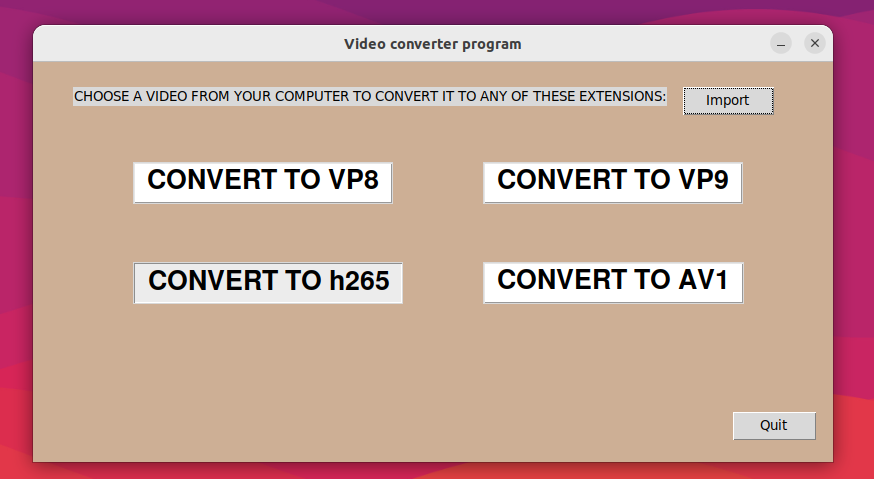

# Sistemes de Codificació de Video: seminar 3

### Exercici1.py:
The first thing to be done in this exercise, was having the bbbVideo.mp4 converted into the following formats: 720p, 480p, 360x240 and 160x120. 
I have already done this conversions in the previous seminar (exercise 3).
Then we should use one of these videos, in my case I choose the bbbVideo.mp4 converted into 480p and cutted to an only 5 seconds video, to convert it to 4 other extensions: VP8, VP9, h265 and AV1. So, basically we can find in these in the 'Exercici1.py' python file which contains a function called ex_1() with an input_video as the only parameter of the function:

    -We get the input video and convert it to a 5 seconds video in order to then be able to do the explained
    extensions in a short period of time.
    -We resize the video into 480p format because is the one we want to convert later to VP8, VP9, h265 and AV1 formats.
    -Finally, converts the bbbVideo of 5 seconds and 480p format into the extensions: VP8, VP9, h265 and AV1.
    
### Create4VideosMosaic.py:
The creation of a video containing together the visualisation of the 4 formats in a mosaic is done with an ffmpeg command and you can find it in the 'Create4VideosMosaic.py' python file in this respository.

Analyze by yourself and comment how these codecs work at each bitrate!! HACER

### interface.py:
Finally, I have created an interface putting all the above together. In this interface called 'Video converter program' a user is able to import a video from his/her computer. The imported video should be in '.mp4' format and then the user is able to apply transformations to that input video. The different transformations that the user is capable of doing are done by clicking the buttons CONVERT TO (VP8, VP9, h265, AV1) and the video is directly saved in the directory where the program is being runned with the followuing names respectively: output_vp8.webm, output_vp9.webm, output_h265.mp4, output_av1.mkv.
The interface has also a button to end the program. You can leave the program by clicking the button 'Quit'.

